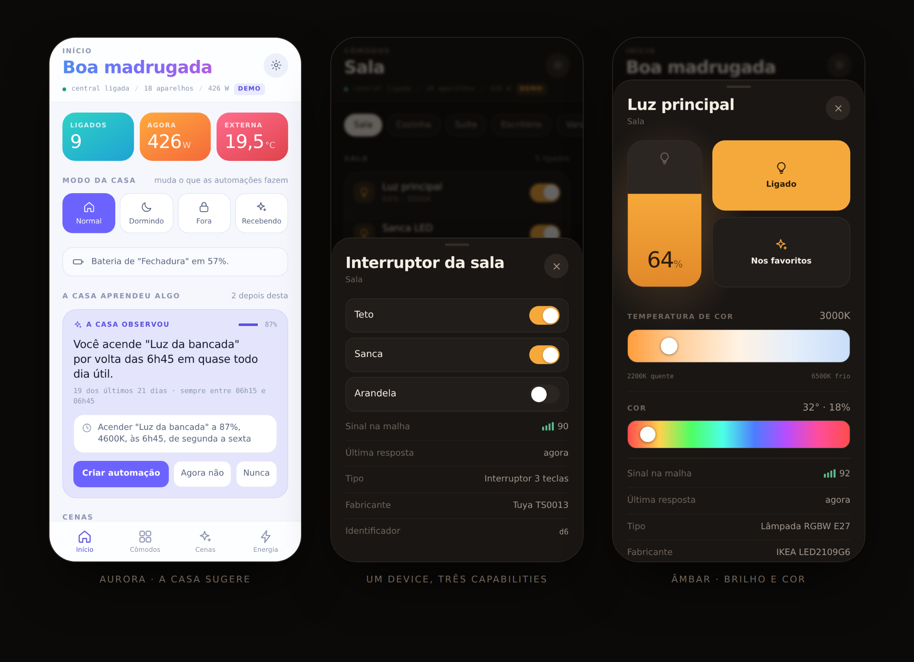

# Nexo

Central de automação residencial que roda na rede da casa e em mais lugar
nenhum. Um Raspberry Pi serve a interface e fala com o hub Zigbee; o
cliente instala o app no iPhone pela tela de início. Sem nuvem, sem
depender da operadora.

A fronteira entre app e central é o **contrato v1** (`/api/v1`): o cliente
nunca conhece o backend, e a tela é montada a partir das *capabilities*
que a central declara — aparelho de modelo novo aparece com os controles
certos sem publicar app.



## Ver funcionando agora

A central inteira, sem hub nenhum:

```bash
npm --prefix server install
node tools/make-icons.mjs
NEXO_ADAPTADOR=simulador node server/nexo.mjs
```

Abra `http://localhost:8080`. Na primeira vez o app pede para criar a
conta do dono (§4 do contrato); depois é login. A casa simulada tem 19
aparelhos, latência de rádio de verdade e um nó de sinal fraco que às
vezes não responde — dá para sentir como a interface se comporta quando a
malha falha, que é o que separa um painel de automação de uma tela bonita.

Só a interface, sem central:

```bash
cd app && python3 -m http.server 8000
```

Sem central alcançável o app cai numa demonstração que fala o mesmo
contrato, com o selo DEMO sempre visível.

Conformidade do contrato:

```bash
node server/ferramentas/conformidade.mjs   # 67 cláusulas
```

Arraste a coluna de brilho na ficha de um dispositivo — é o gesto central
do app. Depois troque a paleta em **Ajustes → Paleta**, mude o **modo da
casa** no Início e veja as rotinas dormirem, e responda a uma sugestão.

## Duas paletas

**Âmbar** (padrão) e **Aurora**, cada uma com tema claro e escuro — quatro
combinações saindo de um só conjunto de variáveis CSS. A escolha fica em
Ajustes; a paleta é ortogonal ao claro/escuro, e âmbar não carimba nada na
raiz, então o custo de ter as duas é um bloco de tokens.

O que **não** muda de paleta: a faixa de temperatura de cor. 2000 K é
laranja e 6500 K é azul em qualquer tema — ali a cor é grandeza física, não
decisão de estilo.

## O que tem aqui

```
app/                interface (documento único, 25 KB gzipado)
  index.html        HTML, CSS e JS juntos — ver "por que um arquivo só"
  manifest.webmanifest
  sw.js             cache da casca, só em contexto seguro
  icons/            gerados por código, não versionados à mão
casa/               configuração da instalação
  casa.json         cômodos, apelidos, cenas, modos e automações
  devices.json      formato antigo, usado só pelo firmware do ESP32
server/             a central, no Raspberry Pi
  nexo.mjs          costura tudo: estáticos, REST, stream, automações
  lib/contrato/     modelo, auth (EdDSA), REST v1, WebSocket v1
  lib/adaptadores/  a fronteira do backend: zigbee2mqtt e simulador
  lib/historico.mjs histórico em JSONL, sem dependência nativa
  lib/aprendiz.mjs  os três detectores que propõem automações
  ferramentas/      conformidade do contrato e semeadura do aprendiz
  deploy/           Caddyfile (TLS) e unidade systemd
firmware/nexo-panel/
  nexo-panel.ino    ESP32 — não implementa o v1; ver docs/contrato-v1.md
tools/
  build.mjs         gzipa e monta dist/sd/ para o cartão
  make-icons.mjs    gera os PNG (codifica o PNG na mão, sem dependências)
docs/
  contrato-v1.md    notas de implementação, acréscimos, o que ficou aberto
  arquitetura.md    topologia, decisões que vieram do rádio, limites
  raspberry.md      centralizar no Pi: o que muda, ganha, perde e instala
  ios-pwa.md        o requisito de HTTPS do iOS e as quatro saídas
  produto.md        onde dá para ganhar deste mercado, e por onde começar
```

## Como está montado

```
iPhone  ──HTTPS + WSS──►  Raspberry Pi  ──Zigbee 3.0──►  malha
 PWA        contrato v1     Caddy (TLS)
                            nexo.mjs (central)
                            Zigbee2MQTT
                            histórico em disco
```

O app fala com **a central**, e nunca soube o que há atrás dela. Trocar
Zigbee2MQTT por Home Assistant é escrever um adaptador em
`server/lib/adaptadores/` — nem o resto do servidor nem uma linha do
cliente mudam.

Instalação no Pi, com TLS e systemd: [docs/raspberry.md](docs/raspberry.md).
O HTTPS não é capricho — é o que destrava Service Worker e Web Push no
iPhone. Leia [docs/ios-pwa.md](docs/ios-pwa.md) antes de entregar.

## A casa propõe, você aprova

O painel registra cada ação manual e, quando encontra repetição, **sugere a
rotina em português** — com o recibo (`11 dos últimos 13 dias úteis`) e a
letra miúda do que exatamente passaria a acontecer. Você aprova, adia ou
recusa. Ninguém escreve regra SE/ENTÃO.

E o inverso também: quando uma rotina é cancelada na mão várias vezes, a
casa propõe **recuar**. Esse segundo movimento é o que impede o ciclo em
que o cliente desliga tudo porque o sistema erra.

Junto disso vêm os **modos da casa** — Normal, Dormindo, Fora, Recebendo.
Um modo não é uma cena: é o estado em que a casa está, e é o que permite ao
mesmo gatilho agir diferente. Rotina fora do modo atual aparece esmaecida e
etiquetada "dorme agora".

O raciocínio completo, com o que construir depois e em que ordem, está em
[docs/produto.md](docs/produto.md). Nada disso precisa de nuvem nem de
modelo: é contagem de frequência em janelas de tempo, umas 200 linhas.

## Duas decisões que valem explicar

**Por que um arquivo só.** A interface inteira é um documento. Um `GET`
gzipado carrega antes de doze arquivos terminarem de negociar conexão, e
num Pi que também roda o Zigbee2MQTT isso se nota.

**Por que as funções dos aparelhos não estão em arquivo de configuração.**
Elas saem do que o backend declara. Lâmpada de modelo novo entra na casa e
aparece na tela com dimmer, temperatura de cor e matiz sem ninguém editar
nada e sem publicar app — que é o princípio 2 do contrato. O que fica em
`casa/casa.json` é só a camada humana: como a casa chama as coisas e onde
elas ficam.

## O desenho

A paleta é literal: o app manipula luz, então o fundo é um cômodo apagado
(`#100E0C`, neutro puxado para o quente) e o acento é âmbar incandescente
(`#F6A93B`) querendo dizer uma coisa só — *aceso*. O eixo âmbar↔azul da
faixa de temperatura de cor é dado, não enfeite. O tema claro é o mesmo
cômodo com a luz acesa.

Sem webfont: o alvo é iPhone, e a SF Pro é a voz nativa da plataforma —
custa zero byte no cartão, o que importa. O caráter vem dos papéis
tipográficos: leituras em peso 200 com numerais tabulares (voz de painel de
instrumento), rótulos em caixa alta com tracking largo, monoespaçado para
endereço IEEE, LQI e IP.

## Estado

A interface está completa e testada nas duas paletas e nos dois temas. O
firmware é um esqueleto funcional: serve o cartão, faz a ponte MQTT e
transmite estado.

A central implementa o contrato v1 e passa 67 verificações de
conformidade. A interface renderiza por capability, nas duas paletas e nos
dois temas, contra a central real e no modo de demonstração. O aprendiz
encontra os três padrões plantados em 30 dias sintéticos sem inventar um
quarto (`node server/ferramentas/semear.mjs`).

Falta: Web Push para os alertas (o HTTPS do Pi já destrava), o botão de
ensaio, o relay para acesso fora da LAN, e a decisão de multi-central.

O ESP32 deixou de ser a central — o contrato v1 é pesado demais para ele.
O firmware fica como referência e como ponto de partida para o papel de
periférico. Os limites conhecidos estão em
[docs/arquitetura.md](docs/arquitetura.md#limites-conhecidos).

---

O histórico anterior deste repositório é o *Map Trash*, do NASA Space Apps
Challenge 2019, sem relação com este projeto.
