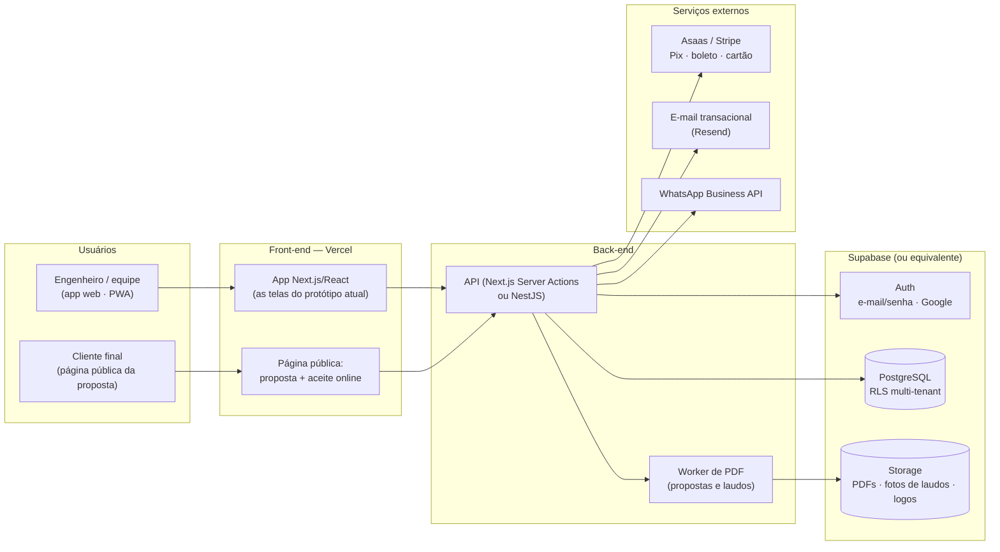
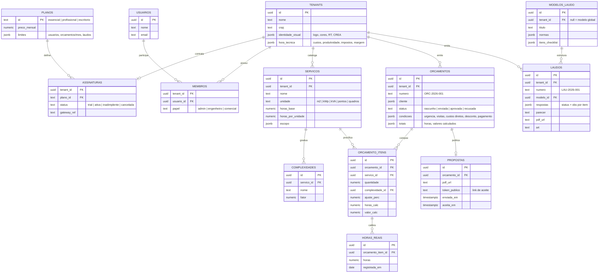
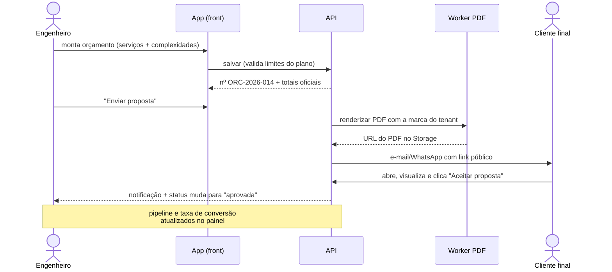
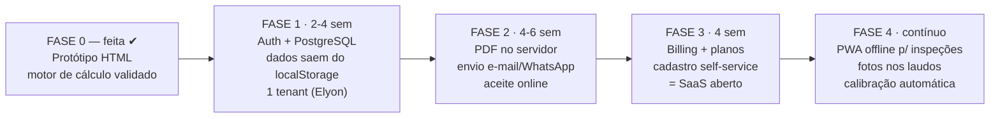

# Arquitetura SaaS — Plataforma Elyon Engenharia

Este documento desenha a plataforma no **formato SaaS**: multi-tenant (cada escritório de
engenharia é um espaço de trabalho isolado), com assinatura por planos, documentos gerados
no servidor e aceite de proposta online. O protótipo HTML deste repositório é a **fase 0**
do plano — as telas e o motor de cálculo já validados migram quase 1:1.

---

## 1. Visão geral da arquitetura

**Decisões-chave:**

- **Multi-tenant com banco único**: todas as tabelas de negócio carregam `tenant_id`, com
  **Row Level Security (RLS)** do PostgreSQL garantindo isolamento no próprio banco — o
  modelo mais barato e simples de operar para um SaaS nesta escala.
- **O motor de cálculo já existe**: as fórmulas de `js/app.js` (hora técnica, horas por
  serviço, composição) viram funções puras compartilhadas entre front (pré-visualização ao
  vivo) e back (valor oficial gravado).
- **PDF no servidor**: propostas e laudos são renderizados no worker (mesmo HTML/CSS de
  impressão do protótipo) e guardados no Storage — cada documento ganha URL estável e
  histórico de versões.

## 2. Modelo de dados (ERD)

A tabela **HORAS_REAIS** é a peça estratégica: registrando as horas efetivamente gastas por
item entregue, a plataforma passa a sugerir coeficientes calibrados por serviço
("seus projetos de SPDA estão saindo 18% acima do estimado") — o diferencial competitivo
frente a planilhas.

## 3. Fluxo principal: do orçamento ao aceite

O mesmo fluxo vale para laudos (sem etapa de aceite): checklist preenchido no celular
durante a inspeção (PWA offline) → PDF numerado no servidor → link para o cliente.

## 4. Planos e monetização (sugestão)

| | **Essencial** — R$ 0 | **Profissional** — R$ 49/mês | **Escritório** — R$ 149/mês |
|---|---|---|---|
| Usuários | 1 | 1 | até 5, com papéis |
| Orçamentos | 10/mês | ilimitados | ilimitados |
| Laudos | — | 4 modelos | 4 modelos + modelos próprios |
| Marca nos documentos | padrão | própria | própria + white-label |
| Aceite online / envio | — | — | ✔ |
| Calibração por horas reais | — | ✔ | ✔ + relatórios de produtividade |

Cobrança via **Asaas** (Pix/boleto — essencial no mercado brasileiro de engenharia) ou
Stripe. Trial de 14 dias do Profissional no cadastro. Preços são sugestão de partida.

## 5. Segurança e multi-tenancy

- **RLS em todas as tabelas**: `tenant_id = auth.jwt() ->> 'tenant_id'` — isolamento no banco,
  não na aplicação.
- Papéis por membro: `admin` (planos, catálogo, hora técnica), `engenheiro` (orçamentos,
  laudos), `comercial` (status e envio, sem ver custos).
- Link público da proposta com token aleatório e expiração pela validade da proposta.
- Laudos são imutáveis após emissão (nova versão = novo documento) — trilha de auditoria.
- Backup diário do banco; exportação JSON por tenant (já existe no protótipo).

## 6. Roteiro de implantação

**Custo de infraestrutura estimado**: R$ 0/mês nas fases 1–2 (free tiers de Vercel +
Supabase) e ~R$ 120–250/mês a partir da fase 3 (planos pagos de infra + domínio + e-mail),
antes de qualquer receita de assinatura.

## 7. Correspondência protótipo → produção

| No protótipo (este repositório) | No SaaS em produção |
|---|---|
| `entrar.html` (login simulado) | Supabase Auth / Clerk (e-mail, Google, MFA) |
| `localStorage` | PostgreSQL multi-tenant com RLS |
| `js/data.js` (catálogo padrão) | Seeds do banco por tenant, editáveis por plano |
| `js/app.js` (motor de cálculo) | Pacote compartilhado front/back (mesmas fórmulas) |
| `window.print()` | Worker de PDF + Storage com URL estável |
| `site.html` (landing) | Site de marketing + onboarding self-service |
| Backup JSON manual | Backup automático + exportação por tenant |
