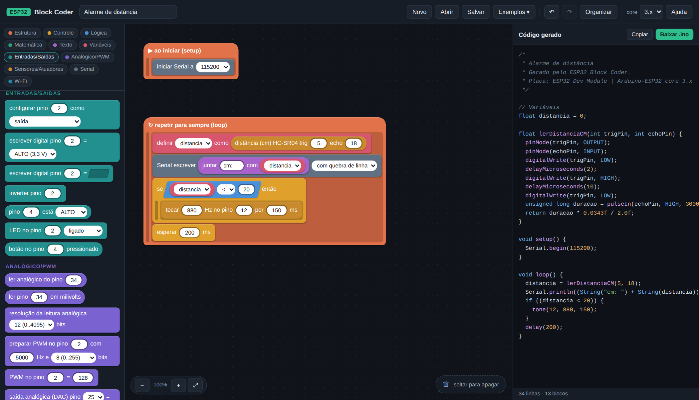

# ESP32 Block Coder

Interface gráfica de programação em blocos que gera código Arduino/C++ pronto
para gravar num ESP32.

Roda inteiramente no navegador, **sem instalar nada e sem internet**: é só abrir
o `index.html`. Não usa Blockly, Scratch-blocks nem qualquer CDN — o editor de
blocos, o gerador de código e a interface são feitos do zero em JavaScript puro.



## Como usar

1. Abra `esp32-block-coder/index.html` no navegador (duplo clique já funciona).
2. Arraste blocos da coluna da esquerda para a área do meio.
3. O código aparece à direita **enquanto você monta**.
4. Clique em **Baixar .ino** (ou **Copiar**) e abra na Arduino IDE para gravar.

Só entra no código o que estiver dentro de **▶ ao iniciar (setup)** ou
**↻ repetir para sempre (loop)**. Blocos soltos ficam na tela como rascunho e o
painel avisa que estão fora do programa.

### Atalhos e gestos

| Ação | Como |
| --- | --- |
| Encaixar comando | Solte perto da borda de outro comando — a barra branca mostra onde vai cair |
| Preencher um valor | Solte o bloco arredondado em cima do espaço correspondente |
| Mover vários comandos | Arraste um comando: tudo que está abaixo dele vai junto |
| Apagar | Arraste até a lixeira, ou selecione e aperte `Delete` |
| Duplicar | Botão direito no bloco |
| Desfazer / refazer | `Ctrl+Z` / `Ctrl+Shift+Z` |
| Mover a tela | Arraste o fundo |

## O que dá para montar

| Categoria | Blocos |
| --- | --- |
| Estrutura | setup, loop, nota, código C++ cru, deep sleep, reiniciar |
| Controle | esperar (ms/µs), se, se/senão, repetir N vezes, contar de..até, enquanto, esperar até, sair/pular |
| Lógica | verdadeiro/falso, comparações, e/ou, não |
| Matemática | número, operações, funções, sortear, converter faixa (`map`), limitar, `millis`/`micros` |
| Texto | texto, juntar, converter para número |
| Variáveis | criar/renomear/apagar, ler, definir, aumentar |
| Entradas/Saídas | `pinMode`, escrever/ler digital, inverter, LED, botão com pull-up |
| Analógico/PWM | `analogRead`, milivolts, resolução, PWM, DAC, toque capacitivo |
| Sensores/Atuadores | DHT11/DHT22, HC-SR04, servo, buzzer |
| Serial | begin, escrever, dado disponível, ler texto |
| Wi-Fi | conectar, status, IP, sinal, HTTP GET, HTTP POST |

O gerador cuida sozinho de algumas coisas chatas:

- **`pinMode` automático** para pinos fixos usados em blocos de LED, botão e
  escrita digital (se você já colocou o bloco `configurar pino`, ele respeita o seu).
- **Objetos de biblioteca** (`DHT`, `Servo`) declarados e inicializados no `setup`
  a partir do simples uso do bloco.
- **Funções auxiliares** (`lerDistanciaCM`, `httpGet`, `httpPost`) incluídas só
  quando algum bloco precisa delas.
- **`#include`** só das bibliotecas realmente usadas.

### core 2.x ou 3.x

O seletor **core** na barra superior escolhe como o PWM e o buzzer são gerados,
porque a API mudou entre as versões do Arduino-ESP32:

| | core 3.x (padrão) | core 2.x |
| --- | --- | --- |
| PWM | `ledcAttach(pino, freq, bits)` + `ledcWrite(pino, valor)` | `ledcSetup(canal, …)` + `ledcAttachPin` + `ledcWrite(canal, valor)` |
| Buzzer | `tone()` / `noTone()` | `ledcWriteTone()` |

Veja sua versão na Arduino IDE em *Ferramentas → Placa → Gerenciador de placas → esp32*.
No core 2.x os canais de PWM são distribuídos automaticamente, um por pino.

## Exemplos incluídos

`Exemplos ▾` na barra superior: projeto em branco, pisca-pisca, botão liga LED,
potenciômetro no Serial, brilho suave com PWM, DHT11, alarme de distância com
HC-SR04, conectar no Wi-Fi e sensor com deep sleep.

## Salvar e continuar depois

- O projeto é salvo sozinho no navegador (`localStorage`) a cada mudança.
- **Salvar** baixa um `.json` com o projeto; **Abrir** carrega esse arquivo de
  volta, inclusive em outro computador.

## Estrutura do código

```
esp32-block-coder/
├── index.html          página única, sem dependências
├── css/styles.css      tema escuro e desenho dos blocos
└── js/
    ├── blocks.js       catálogo: categorias e definição de cada bloco
    ├── model.js        estado do projeto, encaixes, serialização
    ├── generator.js    árvore de blocos → sketch .ino
    ├── render.js       desenho dos blocos em DOM
    ├── drag.js         arrastar, procurar encaixe e soltar
    ├── examples.js     projetos prontos
    └── app.js          paleta, barra de ferramentas, painel de código
```

### Criando um bloco novo

Toda a definição de um bloco vive num único objeto em `js/blocks.js` — não é
preciso mexer em render, arraste ou serialização:

```js
def({
  type: 'led_set',                 // identificador salvo no .json
  cat: 'io',                       // categoria (cor e posição na paleta)
  kind: 'stmt',                    // 'stmt' | 'value' | 'hat'
  tip: 'Atalho para LED: já configura o pino como saída sozinho.',
  text: 'LED no pino %PIN% %VAL%', // "\n" cria nova linha; ">NOME" cria um ramo
  args: {
    PIN: { kind: 'value', type: 'num', def: 2 },
    VAL: { kind: 'field', type: 'select', def: 'HIGH',
           options: [['ligado', 'HIGH'], ['desligado', 'LOW']] }
  },
  gen: function (a, c) {
    c.autoPinMode(a.PIN, 'OUTPUT');
    return 'digitalWrite(' + a.PIN + ', ' + a.raw.VAL + ');';
  }
});
```

Argumentos `kind: 'value'` viram um encaixe **com campo embutido**: enquanto
nenhum bloco estiver plugado ali, o usuário digita o valor direto; ao encaixar
um bloco, ele passa a valer no lugar do campo. Em `gen`, `a.NOME` já vem pronto
para concatenar e `a.raw.NOME` é o conteúdo cru do campo.

Utilidades do contexto `c`: `include`, `global`, `setupLine`, `helper`, `warn`,
`wrap`, `quote`, `autoPinMode`, `pwmAttach`, `pwmWrite`, `tone`, `dhtObject`,
`servoObject`, `tempVar`, `varName`.

## Limitações conhecidas

- Não grava na placa pelo navegador; o fluxo é baixar o `.ino` e usar a Arduino IDE.
- O `pinMode` automático só acontece quando o número do pino é fixo. Se o pino
  vier de uma variável, coloque o bloco `configurar pino` você mesmo.
- Sem blocos de função definida pelo usuário, arrays ou I2C/SPI — para esses
  casos existe o bloco **código C++**.
- O código é gerado sempre com o mesmo formato; não há verificação de sintaxe:
  quem compila é a Arduino IDE.

## Dicas de pinos no ESP32

- 34, 35, 36 e 39 são **somente entrada** — não acionam LED nem relé.
- 6 a 11 são usados pela memória flash interna: não use.
- A leitura analógica dos pinos do ADC2 (0, 2, 4, 12–15, 25–27) não funciona com
  o Wi-Fi ligado; prefira 32–39.
- O LED embutido normalmente é o pino 2.
